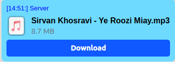

# InfoCard — Qt Info Card (Fluent API)

Lightweight, customizable Qt widget for displaying a summary of a file or item as a card. Built with a Fluent API (chainable setters) inspired by Flutter to make usage concise and readable.

## Table of contents

- [Features](#features)
- [Quick example](#quick-example)
- [API (chainable setters)](#api-chainable-setters)
- [Signals](#signals)
- [Styling & customization](#styling--customization)
- [Files in this folder](#files-in-this-folder)

## Features

- Fluent API: most setters return `InfoCard*` to allow chaining.
- Internal style management: private member variables hold colors, fonts, etc., avoiding external conflicts.
- Inherits from `QFrame`: compatible with Qt Designer and advanced styling.
- `buttonClicked` signal: emitted when the action button is pressed.
- Built-in progress bar for download/upload status.
- Flexible layout using `QVBoxLayout` and `QHBoxLayout`.

## Inheritance

This class inherits from `QFrame`. See `InfoCard.h` for the class declaration (`class InfoCard : public QFrame`).

## Quick example

```cpp
#include "InfoCard.h"

InfoCard* card = new InfoCard(parent);
card->setTitle("Final Report")
	->setFileName("report-final.pdf")
	->setFileSize("14.2 MB")
	->setButtonText("Download")
	->setButtonBackgroundColor(Qt::blue)
	->setButtonTextColor(Qt::white)
	->setTitleColor(Qt::gray)
	->setProgressBarColor(Qt::blue)
	->showProgressBar(true);

// Set an icon
QPixmap icon = card->style()->standardPixmap(QStyle::SP_FileIcon);
card->setIcon(icon);

// Update progress (e.g., during download)
card->updateProgress(75, 100); // 75%

// Connect the button signal
connect(card, &InfoCard::buttonClicked, this, &MyClass::onButtonClicked);
```

Example screenshot:




<hr style="border-top:4px solid #444; margin: 2rem 0;">

## API (chainable setters)

Content setters:

- `setTitle(const QString& title)` — set the card title
- `setFileName(const QString& fileName)` — set the file name
- `setFileSize(const QString& fileSize)` — set the file size / description
- `setButtonText(const QString& text)` — set the action button text
- `setIcon(const QPixmap& pixmap)` — set the icon
- `showProgressBar(bool show)` — show or hide the progress bar
- `updateProgress(qint64 current, qint64 total)` — update progress value

Styling and appearance:

- `setCardBackgroundColor(const QColor& color)`
- `setTitleColor(const QColor& color)`
- `setTitleFont(const QFont& font)`
- `setFileNameColor(const QColor& color)`
- `setFileNameFont(const QFont& font)`
- `setButtonTextColor(const QColor& color)`
- `setButtonBackgroundColor(const QColor& color)`
- `setButtonBorderRadius(int radius)`
- `setProgressBarColor(const QColor& color)`

## Signals

- `buttonClicked()` — emitted when the card's button is pressed.

## Styling & customization

Style values are stored in private member variables (for example `m_cardBgColor`, `m_titleFont`, `m_buttonBgColor`, ...). A private method `updateStyles()` builds style strings from these values and applies them to the widget.

Note: dynamic changes (for example at runtime) will automatically update the appearance when you call the corresponding setter.

## Files in this folder

- `InfoCard.h` — class declaration and chainable setter declarations
- `InfoCard.cpp` — implementation and `updateStyles()`
- `ExampleUsage.cpp` — example usage showing the Fluent API
- `README.md` — this file

## Suggested use cases

- Showing uploaded/downloaded files in a chat list
- User info / profile cards
- File list items in a small file manager
- Download items and their status

## Implementation notes (brief)

- Layouts use `QVBoxLayout` and `QHBoxLayout`, and the main widget inherits from `QFrame`.
- Standard Qt widgets are used for icons and buttons to ensure good compatibility.

<div dir="rtl" lang="fa" style="direction: rtl; text-align: right;">

## InfoCard — یک کارت اطلاعاتی برای Qt (Fluent API)

یک ویجت سبک و قابل سفارشی‌سازی برای نمایش خلاصه‌ای از یک فایل/آیتم در قالب کارت. طراحی شده با "Fluent API" (متدهای زنجیره‌ای) برای نوشتن کد تمیز و خواناتر.

### فهرست محتوا
- [ویژگی‌ها](#ویژگی‌ها)
- [نمونه استفاده (کوتاه)](#نمونه-استفاده-کوتاه)
- [توابع زنجیره‌ای (API)](#توابع-زنجیره‌ای-api)
- [سیگنال‌ها](#سیگنال‌ها)
- [استایل و سفارشی‌سازی](#استایل-و-سفارشی‌سازی)
- [فایل‌های موجود در پوشه](#فایل‌های-موجود-در-پوشه)

## ویژگی‌ها

- API زنجیره‌ای (Fluent): اکثر setterها اشاره‌گر به خود را برمی‌گردانند تا بتوانید تنظیمات را زنجیره‌ای انجام دهید.
- ارث‌بری از `QFrame`: سازگاری با Qt Designer و امکان استفاده از استایل شیت‌های Qt.
- نوار پیشرفت داخلی برای نمایش وضعیت دانلود/آپلود.
- سیگنال برای کلیک دکمه (`buttonClicked`).
- مدیریت استایل داخلی از طریق متغیرهای عضو و یک متد `updateStyles()`.

### ارث‌بری

این کلاس از `QFrame` ارث‌بری می‌کند. تعریف کلاس را می‌توانید در `InfoCard.h` ببینید (`class InfoCard : public QFrame`).

## نمونه استفاده (کوتاه)

مثالِ ساده برای ایجاد و پیکربندی یک `InfoCard`:

```cpp
#include "InfoCard.h"

InfoCard* card = new InfoCard(parent);
card->setTitle("[14:51:] Server")
	->setFileName("Sirvan Khosravi - Ye Roozi Miay.mp3")
	->setFileSize("8.7 MB")
    ->setCardBackgroundColor(QColor("#116edaff"))
	->setButtonText("Download")
	->setButtonBackgroundColor(Qt::blue)
	->setButtonTextColor(Qt::white)
	->setTitleColor(Qt::gray)
	->setProgressBarColor(Qt::blue)
	->showProgressBar(true);

// تنظیم آیکون
QPixmap icon = card->style()->standardPixmap(QStyle::SP_FileIcon);
card->setIcon(icon);

// آپدیت پیشرفت
card->updateProgress(75, 100); // 75%

// اتصال سیگنال
connect(card, &InfoCard::buttonClicked, this, &MyClass::onButtonClicked);
```

## توابع زنجیره‌ای (API)

تنظیم محتوا:

<div style="direction: rtl; text-align: right;">
<ul style="direction: rtl; text-align: right; list-style-position: inside; padding-right: 1em;">
  <li><code dir="ltr">setTitle(const QString&amp; title)</code> — عنوان کارت</li>
  <li><code dir="ltr">setFileName(const QString&amp; fileName)</code> — نام فایل</li>
  <li><code dir="ltr">setFileSize(const QString&amp; fileSize)</code> — اندازه/توضیح فایل</li>
  <li><code dir="ltr">setButtonText(const QString&amp; text)</code> — متن دکمه</li>
  <li><code dir="ltr">setIcon(const QPixmap&amp; pixmap)</code> — آیکون</li>
  <li><code dir="ltr">showProgressBar(bool show)</code> — نمایش/مخفی کردن نوار پیشرفت</li>
  <li><code dir="ltr">updateProgress(qint64 current, qint64 total)</code> — بروزرسانی مقدار نوار پیشرفت</li>
</ul>

استایل و ظاهر:

<ul style="direction: rtl; text-align: right; list-style-position: inside; padding-right: 1em;">
  <li><code dir="ltr">setCardBackgroundColor(const QColor&amp; color)</code></li>
  <li><code dir="ltr">setTitleColor(const QColor&amp; color)</code></li>
  <li><code dir="ltr">setTitleFont(const QFont&amp; font)</code></li>
  <li><code dir="ltr">setFileNameColor(const QColor&amp; color)</code></li>
  <li><code dir="ltr">setFileNameFont(const QFont&amp; font)</code></li>
  <li><code dir="ltr">setButtonTextColor(const QColor&amp; color)</code></li>
  <li><code dir="ltr">setButtonBackgroundColor(const QColor&amp; color)</code></li>
  <li><code dir="ltr">setButtonBorderRadius(int radius)</code></li>
  <li><code dir="ltr">setProgressBarColor(const QColor&amp; color)</code></li>
</ul>
</div>


## سیگنال‌ها (Signals)

* `buttonClicked()` — منتشر می‌شود وقتی کاربر دکمه کارت را فشار می‌دهد.

## استایل و سفارشی‌سازی

مقادیر استایل در متغیرهای عضو خصوصی ذخیره می‌شوند (مثلاً `m_cardBgColor`, `m_titleFont`, `m_buttonBgColor`, ...). متد خصوصی `updateStyles()` بر اساس این مقادیر رشته‌های استایل تولید و روی ویجت اعمال می‌کند.

نکته: برای تغییر‌های پویا (مثلاً در زمان اجرا)، پس از set کردن رنگ/فونت با یکی از setterها، کامپوننت به‌صورت خودکار استایل را به‌روزرسانی می‌کند.

## فایل‌های موجود در پوشه

* `InfoCard.h` — تعریف کلاس و دکلیریشن متدهای زنجیره‌ای
* `InfoCard.cpp` — پیاده‌سازی و `updateStyles()`
* `ExampleUsage.cpp` — نمونه و نحوه استفاده از Fluent API
* `README.md` — این فایل

## موارد استفاده پیشنهادی

* نمایش فایل‌های آپلود/دانلود در یک لیست چت
* کارت‌های اطلاعات کاربر در پروفایل
* آیتم‌های لیست فایل‌ها در فایل‌منیجر کوچک
* نمایش آیتم‌های دانلود و وضعیت آن‌ها

## نکات پیاده‌سازی (مختصر)

* از `QVBoxLayout` و `QHBoxLayout` برای چیدمان استفاده شده و ساختار کلی از `QFrame` مشتق شده است.
* برای آیکون‌ها و دکمه‌ها از ویجت‌های استاندارد Qt استفاده شده است تا سازگاری بالایی وجود داشته باشد.
## مثال 


